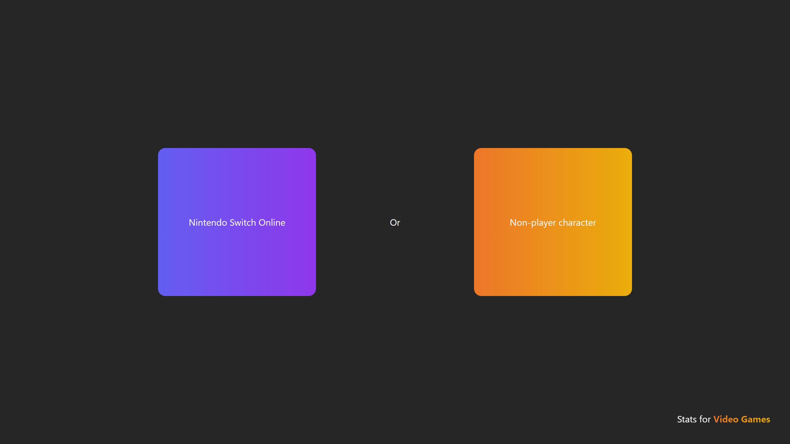
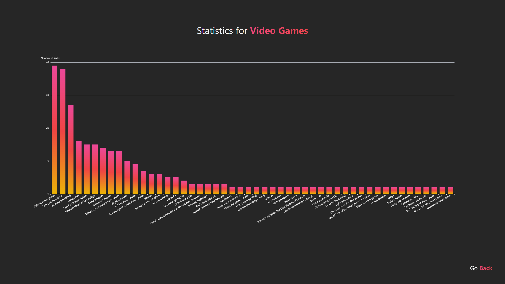

# This or That

A browser based game written in [go](https://go.dev/) which displays two options for the user to pick 
between. Every user's votes are tallied up and displayed
in a graph on the statistics page. It can provide an interesting insight 
into what the public's favourite things in a particular topic are.

## How it Works

This or That works by querying the [Wikipedia API](https://www.mediawiki.org/wiki/API:Main_page)
to gather every link in a supplied page. It then randomly picks two of these links titles and
asks the user to pick between them. I used the links of a given article to generate my data
as I thought it would give a good idea of topics related to a specific category.

The statistics page queries the [BBolt](https://github.com/etcd-io/bbolt) database for the
total times every option in a category has been selected, and displays that information in
a bar chart generated by [Apache ECharts](https://echarts.apache.org/en/index.html).

## Screenshots

## Technologies Used

- [gin, a web framework for go](https://github.com/gin-gonic/gin)
- [bbolt, a key:value database for go](https://github.com/etcd-io/bbolt)
- [Apache ECharts, a javascript graphing library](https://echarts.apache.org/en/index.html)
- [Tailwind CSS, a CSS utility framework](https://tailwindcss.com/)